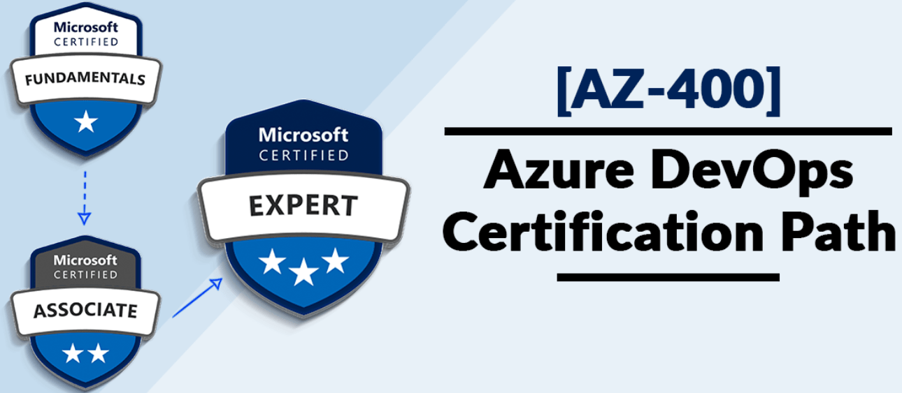
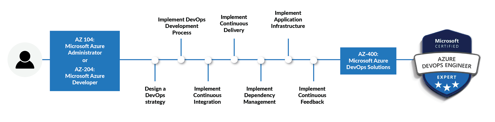

# ROADMAP AZ-400

## Guía de estudio para el examen AZ-400 Diseño e implementación de soluciones de Microsoft DevOps

### Finalidad de este documento
Esta guía de estudio le ayudará a comprender qué esperar en el examen, e incluye un resumen de los temas que el examen podría incluir y vínculos a recursos adicionales. La información y los materiales de este documento le ayudarán a centrar sus estudios a medida que se prepara para el examen.

# Aptitudes evaluadas a partir del 26 de julio de 2024

## Perfil del público

Como ingeniero de DevOps, eres un desarrollador o administrador de infraestructura que también tiene experiencia en trabajar con personas, procesos y productos para habilitar la entrega continua de valor en las organizaciones.

Tus responsabilidades para este rol incluyen la entrega de soluciones de Microsoft DevOps que proporcionan seguridad continua, integración, pruebas, entrega, implementación, supervisión y comentarios. Diseñas e implementas el flujo de trabajo, la colaboración, la comunicación, el control de código fuente y la automatización.

### Equipos multiplataforma en los que trabajas:

- Desarrolladores
- Ingenieros de fiabilidad del sitio
- Administradores de Azure
- Ingenieros de seguridad

Debes tener experiencia en administración y desarrollo en Azure, con aptitudes sólidas en al menos una de estas áreas. También debes tener experiencia en la implementación de soluciones de GitHub y Azure DevOps.

## Aptitudes de un vistazo

- Diseño e implementación de procesos y comunicaciones (10-15 %)
- Diseño e implementación de una estrategia de control de código fuente (10-15 %)
- Diseño e implementación de canalizaciones de compilación y versión (50-55 %)
- Desarrollo de un plan de seguridad y cumplimiento (10-15 %)
- Implementación de una estrategia de instrumentación (5-10 %)

### Diseño e implementación de procesos y comunicaciones (10-15 %)

- Diseño e implementación de la rastreabilidad y el flujo de trabajo
- Diseño e implementación de una estructura para el flujo de trabajo, incluido el flujo de GitHub
- Diseño e implementación de una estrategia para los ciclos de comentarios, incluidas las notificaciones y los problemas de GitHub
- Diseño e implementación de la integración del trabajo de seguimiento, incluidos proyectos de GitHub, Azure Boards y repositorios
- Diseño e implementación de la rastreabilidad del origen, el error y la calidad
- Diseño e implementación de métricas y consultas adecuadas para DevOps
- Diseño e implementación de un panel, incluido el flujo de trabajo, como los tiempos de ciclo, el tiempo de recuperación y el plazo
- Configuración de la colaboración y la comunicación
- Documentación de un proyecto configurando diagramas de procesos y wikis, incluida la sintaxis Markdown y Mermaid

### Diseño e implementación de una estrategia de control de código fuente (10-15 %)

- Diseño e implementación de estrategias de bifurcación para el código fuente
- Diseño de una estrategia de ramificación, incluida la rama basada en troncos, la rama de características y la rama de versión
- Configuración y administración de repositorios
- Diseño e implementación de una estrategia para administrar archivos grandes, incluidos el Almacenamiento de archivos grandes (LFS) de Git y git-fat
- Configuración de permisos en el repositorio de control de código fuente

### Diseño e implementación de canalizaciones de compilación y versión (50-55 %)

- Diseño e implementación de una estrategia de administración de paquetes
- Diseño e implementación de fuentes y vistas de paquetes para paquetes locales y ascendentes
- Diseño e implementación de una estrategia de control de versiones de dependencia para los recursos y paquetes de código, incluido el control de versiones semántico (SemVer) y basado en fechas (CalVer)
- Diseño e implementación de una estrategia de control de versiones para artefactos de canalización
- Implementación del análisis de cobertura de código
- Diseño e implementación de una estrategia de resistencia para la implementación

### Desarrollo de un plan de seguridad y cumplimiento (10-15 %)

- Diseño e implementación de métodos de autenticación y autorización
- Implementación y administración de secretos, claves y certificados mediante Azure Key Vault
- Automatización del examen de seguridad y cumplimiento
- Configuración de la seguridad de DevOps para Microsoft Defender for Cloud

### Implementación de una estrategia de instrumentación (5-10 %)

- Configuración de la supervisión de un entorno de DevOps
- Configuración de Azure Monitor y Log Analytics para la integración con herramientas de DevOps
- Análisis de métricas de la instrumentación

